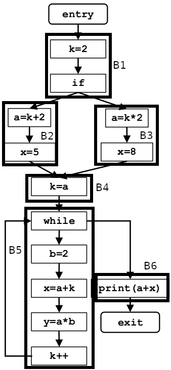

# Constant progation

<b>Framework</b>

Algorithm variable | Description
--- | ---
Domain | all couples (var, constant_value)
Direction | forward <br> out[B] = F<sub>B</sub>(in[B]) <br> in[B] = M(out[predecessorB])
Transfer function (F) | F<sub>B</sub>(in[B]) = Gen<sub>B</sub> ∪ (in[B] - Kill<sub>B</sub>) <br> Gen<sub>B</sub> and Kill<sub>B</sub> are determined by analyzing the instructions of the block B in descending order: the generated couples are the locally available definitions of all the variables where the right hand side is a constant or can be considered constant considering all couples that have been propagated by the specific define instruction; to determine the killed couples it must be considered that any definition of a variable kills all the other couples with the same variable present in the universe set <br> out[inst] = F<sub>inst</sub>(in[inst]) = Gen<sub>inst</sub> ∪ (in[inst] - Kill<sub>inst</sub>) <br> where <br> Gen<sub>inst</sub> = (defined_var, const_val) if the right hand side can be considered constant, which means it only contains constants or variables that are contained in the couples propagated by the preceding instruction or block, <br> in[inst] are the couples propagated by the preceding instruction and in[inst] = in[B] for the first instruction of the block, <br>  Kill<sub>inst</sub> = (defined_var, CONST), "CONST" staying for any constant value
Meet operator (M) | intersection
Boundary condition | out[entry] = ∅
Initial interior points | out[B] = ∩


<b>Pseudocode</b>
```
input = Control Flow Graph CFG (Nodes, Edges, Entry, Exit)

Universe = ∅
for all variables x defined in the entire function, add (x,const) to Universe

// Boundary condition
out[Entry] = ∅

// Initialization
for each basic block B
    out[B] = Universe

while (changes to any out[] occour)
{
    for each basic block B other than Entry
    {
        in[B] = ∩(out[p]) for all predecessors p of B
        out[B] = F_B(in[B])
    }
}
```


<b>Observations</b>
- Since a variable with a constant value can be used to define another variable, the latter can become a variable with a constant value as well.
- As a consequence, the universe set is not easily fully determined at the beginning; for this reason, it has been chosen to initialize it with a placeholder for the constant value, CONST.
- The last choice entails that in an actual implmentation, a variable length data structure must be chosen to represent the set of all couples that can be generated by the function under analysis, and not a simple bit vector. The representation of all possible couple will just be called "Data representation at point p", where p is point of the flow under analysis (e.g. before block 3, after block 1, at exit, etc)
- At any point of the algorithm, for any variable identified only a single couple can be propagated, otherwise the value of the variable wouldn't be a precise constant for definition. <br> Demonstration: in fact, a block can only generate a couple for a constant x if it's defining x, and an instruction cannot define more than one variabile; if the block is generating a couple for x, it cannot be propagating any other couple for x, since the definition has killed all other couples for that variable; instead if the block is not generating a couple for x but it is propagating it, that couple it must have been generated by a preceding block, any block can only generate a couple for the variable x and the meet operator intersection ensures that only a single couple for x is being propagated. The same can be applied for a single instruction in a block.


<b>Example</b>



Universe = {(a, CONST) , (b, CONST), (x, CONST), (y, CONST), (k, CONST)}

Boundary condition and initialization
Flow point | Data representation
--- | ---
out[Entry] | ∅
in[B1] | -
out[B1] | U
in[B2] | -
out[B2] | U
in[B3] | -
out[B3] | U
in[B4] | -
out[B4] | U
in[B5] | -
out[B5] | U
in[B6] | -
out[B6] | U
in[Exit] | -

Iteration 1
Flow point | Data representation
--- | ---
out[Entry] | ∅
in[B1] | ∅
out[B1] | (k,2) ∪ (∅-(k,CONST)) = (k,2)
in[B2] | (k,2)
out[B2] | (a,<u>k</u>+2)(x,5) ∪ ((<u>k,2</u>) - (a,CONST)(x,CONST)) = (a,4)(x,5)(k,2)
in[B3] | (k,2)
out[B3] | (a,<u>k</u>*2)(x,8) ∪ ((<u>k,2</u>) - (a,CONST)(x,CONST)) = (a,4)(x,8)(k,2)
in[B4] | out[B2] ∩ out[B3] = (a,4)(k,2)
out[B4] | (k,<u>a</u>) ∪ ((<u>a,4</u>)(k,2) - (k,CONST)) = (k,4)(a,4)
in[B5] | (k,4)(a,4) ∩ U = (k,4)(a,4)
out[B5] | (<u>b,2</u>)(x,<u>a</u>+<u>k</u>)(y,<u>a</u>*<u>b</u>) ∪ ((<u>k,4</u>)(<u>a,4</u>) - (b,CONST)(k,CONST)(x,CONST)(Y,CONST)) = (b,2)(x,8)(y,8) ∪ (a,4) = (a,4)(b,2)(x,8)(y,8) <br> the couple (k,4) is killed as last instruction in the block, and the generation of the couple (x,8), which relies on the constant value of k, happens before that point
in[B6] | (a,4)(b,2)(x,8)(y,8)
out[B6] | (a,4)(b,2)(x,8)(y,8)
in[Exit] | (a,4)(b,2)(x,8)(y,8)

changes have been registered

Iteration 2
Flow point | Data representation
--- | ---
out[Entry] | ∅
in[B1] | ∅
out[B1] | (k,2)
in[B2] | (k,2)
out[B2] | (a,4)(x,5)(k,2)
in[B3] | (k,2)
out[B3] | (a,4)(x,8)(k,2)
in[B4] | (a,4)(k,2)
out[B4] | (k,4)(a,4)
in[B5] | (k,4)(a,4) ∩ (a,4)(b,2)(x,8)(y,8) = (a,4) <br> the cycle incrementing k continuously kills the couple (k,4) that the flow propagates till the while statement
out[B5] | (<u>b,2</u>)(x,<u>a</u>+k)(y,<u>a</u>*<u>b</u>) ∪ ((<u>a,4</u>) - (b,CONST)(k,CONST)(x,CONST)(Y,CONST)) = (b,2)(y,8) ∪ (a,4) = (a,4)(b,2)(y,8) <br> the resolution of the couple (x,a+k) to a constant value failed, because the no couple of the variable k is propagated from this iteration
in[B6] | (a,4)(b,2)(y,8)
out[B6] | (a,4)(b,2)(y,8)
in[Exit] | (a,4)(b,2)(y,8)

changes have been registered


Iteration 3
Flow point | Data representation
--- | ---
out[Entry] | ∅
in[B1] | ∅
out[B1] | (k,2)
in[B2] | (k,2)
out[B2] | (a,4)(x,5)(k,2)
in[B3] | (k,2)
out[B3] | (a,4)(x,8)(k,2)
in[B4] | (a,4)(k,2)
out[B4] | (k,4)(a,4)
in[B5] | (k,4)(a,4) ∩ (a,4)(b,2)(y,8) = (a,4)
out[B5] | (a,4)(b,2)(y,8)
in[B6] | (a,4)(b,2)(y,8)
out[B6] | (a,4)(b,2)(y,8)
in[Exit] | (a,4)(b,2)(y,8)

no changes have been registered
